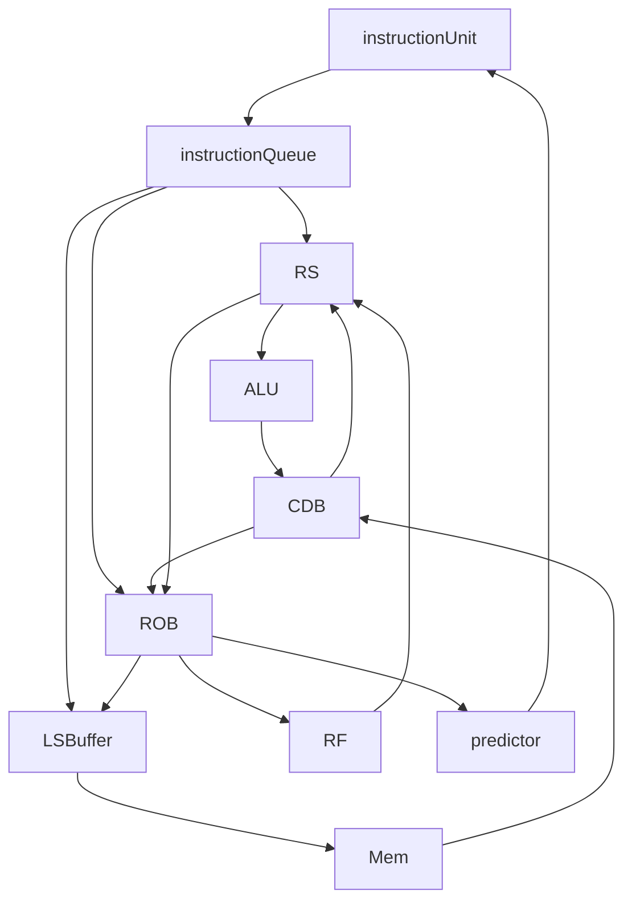

```mermaid
graph TD;
    instructionUnit-->instructionQueue;
    instructionQueue-->RS;
    instructionQueue-->ROB;
    instructionQueue-->LSBuffer;
    RS-->ALU;
    LSBuffer-->Mem;
    ALU-->CDB;
    Mem-->CDB;
    CDB-->RS;
    CDB-->ROB;
    RS-->ROB;
    ROB-->LSBuffer;
    ROB-->RF;
    RF-->RS;
    ROB-->predictor;
    predictor-->instructionUnit;
```